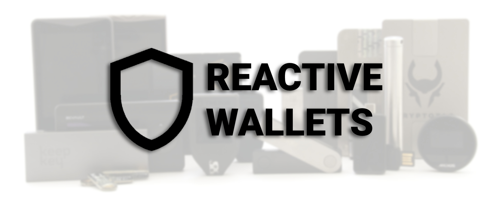
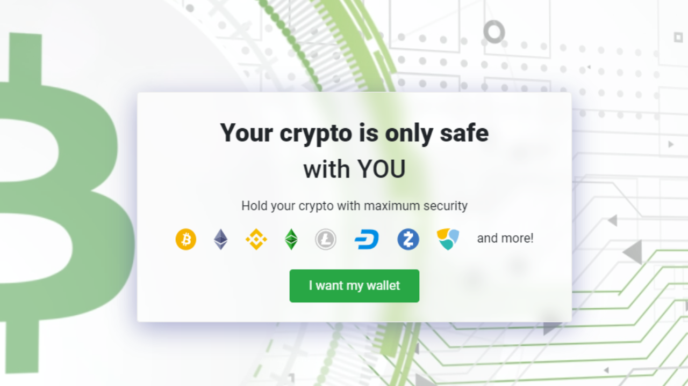
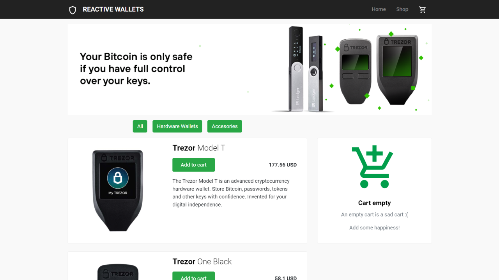
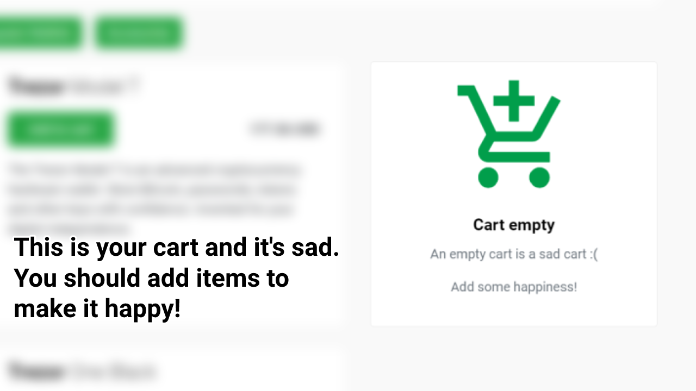
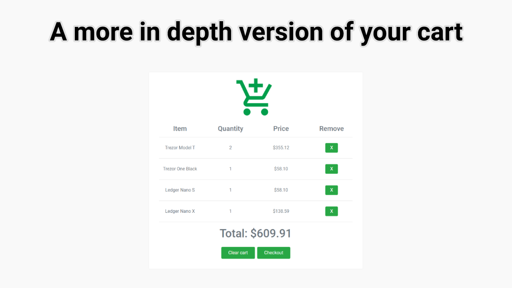
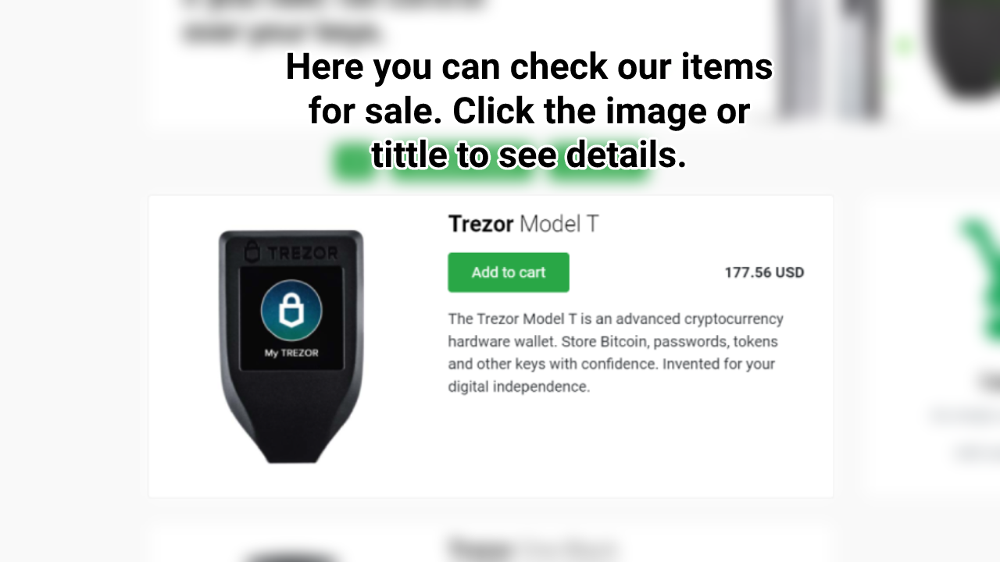
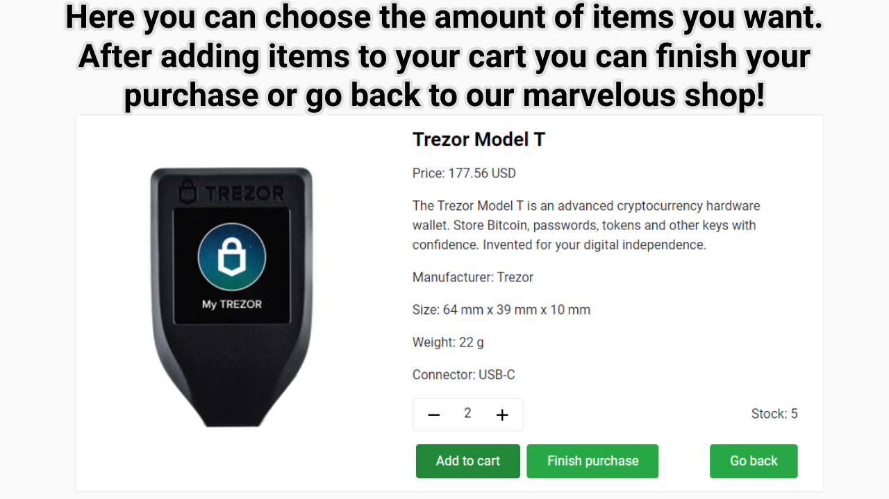
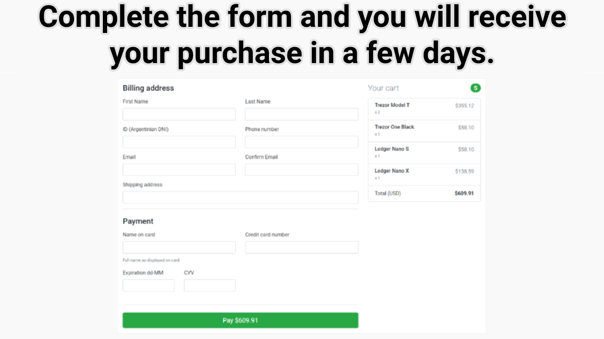

<!-- PROJECT LOGO -->
<br />
<p align="center">
  <a href="#">
    
  </a>

  <h3 align="center">REACTIVE WALLETS</h3>

  <p align="center">
    The only place to keep your crypto safe
    <br />
    <a href="https://github.com/JDenaro/coderhouse-react/blob/main/README.md"><strong>Explore the docs »</strong></a>
    <br />
    
  </p>
</p>

<!-- ABOUT THE PROJECT -->
## About The Project

This is my final project for ReactJs course at [CoderHouse](https://www.coderhouse.com/)

Hardware wallet is a special type of security device allowing users to store their cryptocurrency holdings. Reactive Wallets offers the most secure cryptocurrency hardware wallets. It enables you to make secure payments and manage cryptocurrencies without exposing any sensitive information to a potentially compromised computer.

### Built With


* [React](https://reactjs.org/)
* [Bootstrap](https://getbootstrap.com)
* [React-Bootstrap](https://react-bootstrap.github.io/)
* [Formik](https://formik.org/)


<!-- GETTING STARTED -->
## Getting Started


### Prerequisites


* 
  ```sh
  Willingness to test my website 
  ```

<!-- USAGE EXAMPLES -->
## Website Usage

If your grandmother understands these instructions it means we did a great job!

This is our home screen. Just click the "I want my wallet" button to access the shop.


Welcome to our shop!













<!-- LICENSE -->
## License

Feel free to do whatever you want with this project.


<!-- CONTACT -->
## Contact

Julian Denaro - [LinkedIn](https://www.linkedin.com/in/juliandenaro/)

Project Link: [https://github.com/JDenaro/coderhouse-react](https://github.com/JDenaro/coderhouse-react)


<!-- ACKNOWLEDGEMENTS -->
## Acknowledgements
* [Trezor Shop](https://shop.trezor.io/) Best hardware wallets ever!
* [Animate.css](https://daneden.github.io/animate.css)
* [Google Fonts](https://fonts.google.com/)
